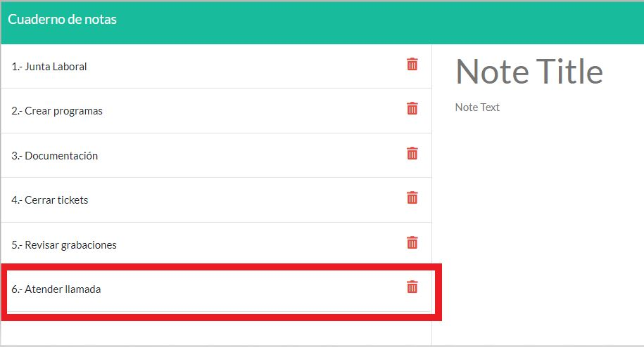

# Cuaderno de notas

## Descripción de la aplicación  

* La aplicación permite al usuario escribir y guardar notas para llevar un registro de las tareas a completar.
* Cuando se abre el cuaderno de notas, se presenta una página de inicio con un botón que lleva a la página de notas.
* Al presionar el botón de la página de notas:
    * Se despliega una página con notas existentes numeradas en la columna de la izquierda.
    * Se muestran dos campos vacíos para proporcionar un nuevo título de nota y el texto de la nota en la columna de la derecha.
* Cuando el usuario introduce un título y texto para la nueva nota, aparece el ícono de Guardar en la parte superior de la página.
* Al presionar en el ícono de Guardar, la nueva nota se guarda y aparece en la columna izquierda junto con las otras notas existentes.
* Al hacer clic sobre cualquier nota existente de la columna izquierda, la nota seleccionada se despliega en la columna derecha.
* Cuando se hace clic en el ícono de "+" en la parte superior de la página, se presentan campos vacíos para llenar el título y el texto de una nueva nota en la columna derecha.
* Al presionar el ícono de Borrar para cualquier nota existente, la nota seleccionada se borra, ya no aparece en la columna de la izquierda y la numeración de la lista cambia.
* Esta aplicación está desplegada en Heroku.

## Instrucciones de instalación  

* Esta aplicación requiere de:
    * Instalación de node JS versión 16.18.0
    * Instalación del paquete npm express versión 4.17.1
    * Instalación del paquete npm uuid versión 8.3.2
* Además, esta aplicación emplea:
    * El módulo util.
    * El módulo fs para la lectura y escritura del archivo JSON "db.json" que contiene todas las notas guardadas.

## Instrucciones para realizar pruebas 

* La ejecución de la aplicación se tiene que hacer desde la terminal de node.js
* Asegúrate de estar en la ubicación de la carpeta principal/raíz de la aplicación: CUADERNO-DE-NOTAS\  
  
* Ejecuta el comando: "npm start"  
  
* Aparecerá un mensaje de que la aplicación está escuchando en el puerto 3001  
  
* Ve a tu navegador de internet e introduce la dirección http://localhost:3001  
  
* Después de estos pasos podrás ver la página de inicio de la aplicación y comenzar a hacer pruebas  

## Información de uso de la aplicación 

* Ingresa a la aplicación por medio del enlace de Heroku proporcionado o de forma local (usando la url http://localhost:3001).
* Una vez que estés en la página de inicio, presiona el botón de "Comenzar".  
  
* Esta última acción te llevará a la página de notas donde podrás desplegar las notas existentes, crear y guardar una nueva nota o borrar una nota existente.
* El ícono de "+" te permite crear una nueva nota, por lo que puedes presionarlo en cualquier momento para llenar los campos necesarios para crear una nueva nota.  
  
* Si deseas agregar una nueva nota:
    1. Llena los campos de "Note Title" y "Note Text".  
       
    2. Cuando ambos campos estén llenos, aparecerá el ícono de Guardar en la parte superior.  
       
    3. Presiona el ícono de Guardar.
       
    4. Verás tu nueva nota desplegada en la columna de la izquierda.  
       
* Si deseas desplegar una nota existente, solamente da clic sobre cualquiera de ellas y su información aparecerá en la columna derecha.  
  
* Si deseas borrar una nota existente, solamente debes presionar el ícono de Borrar para la nota que deseas borrar. Esto hará que la nota sea borrada y desaparezca de la columna de la izquierda.  
  
  
* Si deseas regresar a la página de inicio, puedes hacer clic sobre el texto "Cuaderno de Notas".  
  

## Enlace a aplicación

* [Link a aplicación]()

## Apariencia de la aplicación

### Página de Inicio

### Página de Notas

